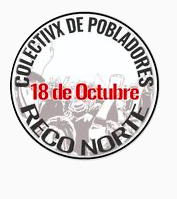

#### FOLIO: REC7
# Colectivx 18 de Octubre

[instagram](https://www.instagram.com/colectivxreco18oct/)
---

### Representantes
#### 
No señalan tener representantes.

---
### Interacciones frecuentes
#### 
* La madriguera
* Colectivo cipriano pontigo

### Redes sociales
#### ¿Para qué se utiliza la red social?
| Instagram | 
|---|
|Difusion de informacion y actividades|

### **Instagram**
| seguidores | seguidos | publicaciones | hashtag 
|---|---|---|---|
|819|764|58| 0

---

* **Actividad:**   
* Primera Publicación IG: 04/12/2019. Inactiva desde el 24/11/2020

---
### Frecuencia de publicación.
* Publicaciones: Mensual
* Actividades: Mensual

---
### Ubicación
* RECOLETA CON ROSENTE ( en el respi) // población Escritores de Chile

---
### Describir temas de interés y/o trabajo
* Protesta
* Alimentación
* Colaboracion y apoyo para los vecinnos

---
### Describir la imagen ideal por la cual se trabaja.
#### (El horizonte hacia el cual se quiere avanzar.)
> Encontramos en el territorio nuestras formas de hacer política, de reconocernos, organizarnos y apañarnos.

---
### ¿Que se hace?
#### (Manifestaciones, marchas, intervenciones, actividades culturales, conversatorios, intercambio de saberes, actividades solidarias o de apoyo mutuo, abastecimiento, contra información, emplazamiento a autoridades etc.)
* Pancito comuntiario

* Talleres para NNA
* Jornadas de protesta popular
* Agitación y propaganda
* Jornadas de protesta feministas
* Manifestaciones
    * Noche kutxal [link](https://www.instagram.com/p/CDRCfscJgOO/) / Resistencia ancestral del Wallmapu [link](https://www.instagram.com/p/CDdAgx0J_l-/)
    * Barricadas
    * Cacerolazos
    * Velatones
* Cine al aire libre
* Actividades de conmemoración
* Colecta solidarias de alimentos y utiles de aseo

---
### Describir y distinguir demandas más reivindicativas de espacios sin relación con lo contencioso o con lo político mas prefigurativo
#### (lo contencioso; demanda al Estado, a alguna autoridad, privados, etc), (prefigurativo, transformación desde lo cotidiano, etc.).
* Hacia los vecinos, que se organicen y participen
* A las autoridades ante la crisis que vive la ciudadania quienes no se han hecho cargo y solo han reprimido al pueblo

---
### Tipo de organización interna.
#### 
Asambleismo y horizontalidad. Deben trabajar en comisiones.

---
### Describir los temas / imágenes- iconos / conceptos mas habitualmente presentes en sus publicaciones. Describir cambios/ transformaciones en los contenidos desde Octubre.
Su contenido se ha mantenido similar, entre llamados a protestas y realizacion del pancito comunitario. La ultima publicacion la realizan el 25/11/2020.

**Iconos:**

**Diseño estético:**
No tienen diseño estético fijo, sin embargo, tienen organizadas algunas actividades en sus historias destacadas.

---
### Percepciones que se tiene del Estado
#### (Aparato burocrático)
> estado asesino y criminal. Las mujeres de la pobla tienen miedo que sus hijos no vuelvan porque los maten.

---
### Percepciones que se tiene de las Fuerzas de Orden
#### (Aparato represivo)
> Actuar de la policia que gasean excesivamente e indiscriminadamente los hogares de Recoleta Norte. 

---
### Incorporar aca notas, citas textuales, links, etc. extra a los ya incorporados, que sean de interés para comprender tanto la forma como los contenidos asociados a la organización.
* DEclaración de principios [link](https://www.instagram.com/p/CEVGNyqJs4o/)
> Estos actos están fundados en el amor y la justicia que nos debemos como clase; y, el compañerismo, cariño, apoyo mutuo y solidaridad que concretizan dichos sentimientos.
