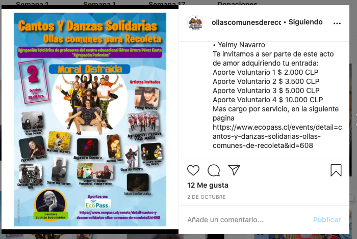
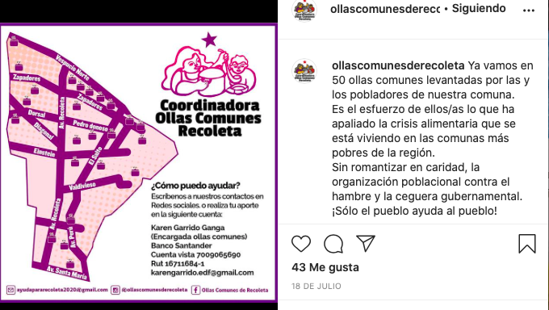
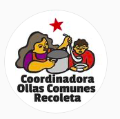
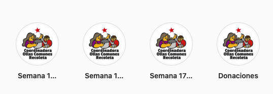
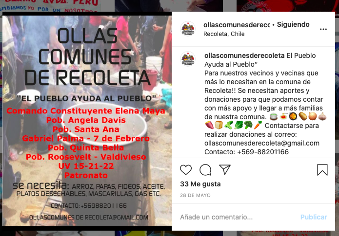

#### FOLIO: REC8
# Coordinadora Ollas Comunes de Recoleta

[instagram](https://www.instagram.com/ollascomunesderecoleta/)
[facebook](https://www.facebook.com/OllasComunesDeRecoleta)
<ayudapararecoleta2020@gmail.com> / <ollascomunesderecoleta@gmail.com>
---

### Representantes
#### 
No señalan tener representantes.

---
### Interacciones frecuentes
#### 
* Olla comun solo el pueblo ayuda al pueblo
* olla comun barrio avda peru
* olla común por la dignidad de recoleta norte

### Redes sociales
#### ¿Para qué se utiliza la red social?
| Instagram | Facebook | 
|---|---|
|Difusion de informacion y actividades|Difusion de informacion y actividades|

### **Instagram**
| seguidores | seguidos | publicaciones | hashtag 
|---|---|---|---|
|626|590|66| 0

---

* **Actividad:**   

* Primera Publicación IG: 28/05/2020. Inactivos desde el 20/10/2020

---
### Frecuencia de publicación.
* Publicaciones: Semanales (1 x semana)
* Actividades: Semanales

---
### Ubicación
* recoleta en general

---
### Describir temas de interés y/o trabajo
* Alimentación
* Coordinacion entre ollas comunes

---
### Describir la imagen ideal por la cual se trabaja.
#### (El horizonte hacia el cual se quiere avanzar.)

---
### ¿Que se hace?
#### (Manifestaciones, marchas, intervenciones, actividades culturales, conversatorios, intercambio de saberes, actividades solidarias o de apoyo mutuo, abastecimiento, contra información, emplazamiento a autoridades etc.)
* Apoyo al proceso constituyente, apruebo y convención constituyente
* Acopio y entrega de alimentos no perecibles a las ollas comunes de recoleta
    * Gas solidario
    * Sacos de papa
* Acciones para juntar fondos

* Infografias de cómo aportar a las ollas comunes
* Difusión de localizacion de ollas comunes

---
### Describir y distinguir demandas más reivindicativas de espacios sin relación con lo contencioso o con lo político mas prefigurativo
#### (lo contencioso; demanda al Estado, a alguna autoridad, privados, etc), (prefigurativo, transformación desde lo cotidiano, etc.).
* Hacia las personas en general para que aporten a las ollas comunes de recoleta.

---
### Tipo de organización interna.
#### 
Horizontalidad. Deben tener vocerias y trabajar por comisiones.

---
### Describir los temas / imágenes- iconos / conceptos mas habitualmente presentes en sus publicaciones. Describir cambios/ transformaciones en los contenidos desde Octubre.
Su contenido se focaliza en la alimentación, en la colaboracion para que las personas afectadas por la crisis en recoleta puedan acceder a alimentos. Paran sus publicaciones el 20/10/2020, esto tambien sucede en facebook.

**Iconos:**

**Diseño estético:**
No tienen diseño estético fijo, sin embargo, tiene organizada ciertas acciones en sus historias destacadas. Suben contenido para aportar a las ollas comunes, de lo que se cocina y dónde estas se ubican.

---
### Percepciones que se tiene del Estado
#### (Aparato burocrático)
> No señalan postura

| Declaraciones | infografía | 
|---|---|
|Anotar los comunicados | [Link]() |

---
### Percepciones que se tiene de las Fuerzas de Orden
#### (Aparato represivo)
> No señalan postura

| Declaraciones | infografía | 
|---|---|
|Anotar los comunicados | [Link]() |

---
### Incorporar aca notas, citas textuales, links, etc. extra a los ya incorporados, que sean de interés para comprender tanto la forma como los contenidos asociados a la organización.
* Señalan cuentas para hacer donaciones, tanto de whatsapp como de correo. Ahi señalan cuáles son las ollas que aportan. 

